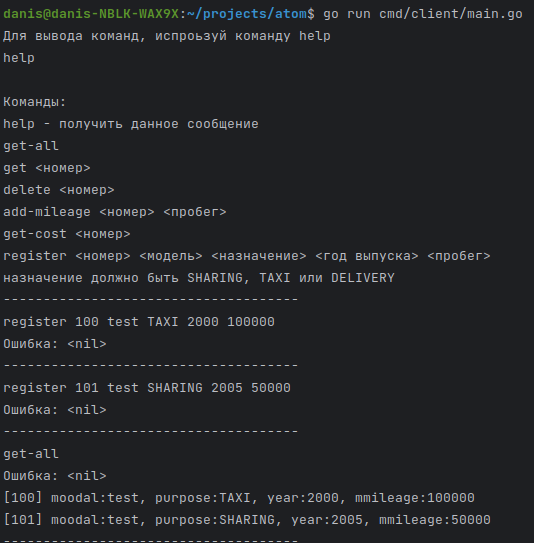
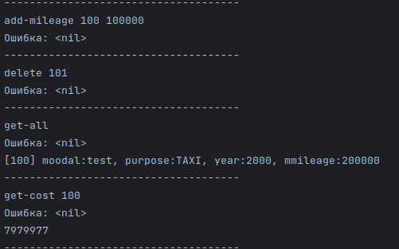

# Fleet Management System
## Установка
```sh
git clone git@github.com:py354/atom.git
```
### Запуск вручную
1. Установить данные потсгреса в config/config.yaml (логин и пароль можно в переменных среды)
2. Запустить сервер ```go run cmd/server/main.go```
3. Запустить клиент ```go run cmd/client/main.go```

## Описание системы
Приложение делится на клиента и сервера, взаимодействующих через gRPC. В качестве базы данных используется Postgres. В папке internal/ - весь внутренний код. Папка app/ для реализации логики приложения, используется уменьшение связанности со слоем базы данных через репозиторий. 

## Показ работы




